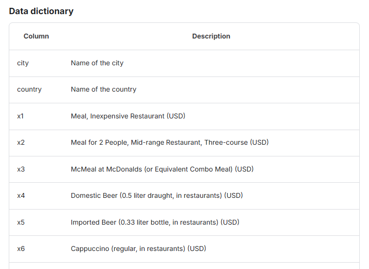

# 💹 World cities cost of living predictor using AI & Machine Learning. 

This is an interactive application developed with Streamlit, Scikit-learn and Matplotlib libraries and .csv files. 

The objective is predict the cost of living in some country and citie from Kaggle from Kaggle (link [here]("https://www.kaggle.com/datasets/mvieira101/global-cost-of-living")) dataset and predict this costs with mathematical analysis like Linear Regression and Mean Square error.

## 📝 Features: 
- Extract values from .csv dataset for a specific a country and city.
  - 💰 Estimated monthly cost 
  - 📈 Average net salary
  - ⚖️ Cost/Salary ratio
- Generate a graphic bar comparing Estimated monthly cost and Average net salary between cities from a selected country.
- Predict values of costs of living using Linear Regression 

## 🐍 Requirements:

Make sure you have the following installed on your machine:
- Python 3.8 or higher 
- Libraries listed in requirements.txt

## 🚀 Installation:
1. Clone the repository or download the files.
```
git clone <repository-url>
cd <repository-name>
```
2. Install the dependencies.
```
pip install -r requirements.txt
```
Ensure that the cost-of-living.csv are into data folder the same directory as the code.

## 📊 Data Structure:
- This dataset contains information about the cost of living in almost 5000 cities across the world. The data were gathered by scraping Numbeo's website (https://www.numbeo.com). 
- The cost-of-living.csv dataset contains a data dictionary with a 55 columns, description and values.
See the 6 first collumns in this screenshot below:



## 📁 Directory structure:

This application have modulate organization like the structure below: 
```
cost_of_living_app/
├── app.py                     # main application with Streamlit
├── data/
│   └── cost-of-living.csv     # dataset
├── utils/
│   └── data_loader.py         # load and pre-processing functions
│   └── analysis.py            # analysis and calculation functions
│   └── visualization.py       # graphic generation function
```

## 🛞 Usage
Run the Streamlit application: 
```
streamlit run <file-name>.py
```

## ✏️ Code and ML trainning model: 

This app was organised in module, thus, see the full code in each file. 
Because of this, it's important show some aspects of ML trainning model here, see code below:  

```
from sklearn.linear_model import LinearRegression
from sklearn.model_selection import train_test_split
from sklearn.metrics import mean_squared_error
import pandas as pd

def train_cost_model(df: pd.DataFrame):
    features = ["Meal_Inexpensive", "Monthly_Transport_Pass", "Rent_City_Center_1BR", "Basic_Utilities"]
    df = df.dropna(subset=features + ["Estimated_Monthly_Cost"])
    X = df[features]
    y = df["Estimated_Monthly_Cost"]

    X_train, X_test, y_train, y_test = train_test_split(X, y, test_size=0.2, random_state=42)

    model = LinearRegression()      #used to test a dependent variable (Estimated_Monthly_Cost) and independent variables group. 
    model.fit(X_train, y_train)

    y_pred = model.predict(X_test)  #compatible with linear regression, easy interpretation and reduce bad error predictions. 
    mse = mean_squared_error(y_test, y_pred)

    return model, mse
```

## 🗒️ License:
This project is licensed under the MIT License. See the LICENSE file for more information.

## 💡 Credits
Developed with 💖 by Alisson T. Bucchi. 